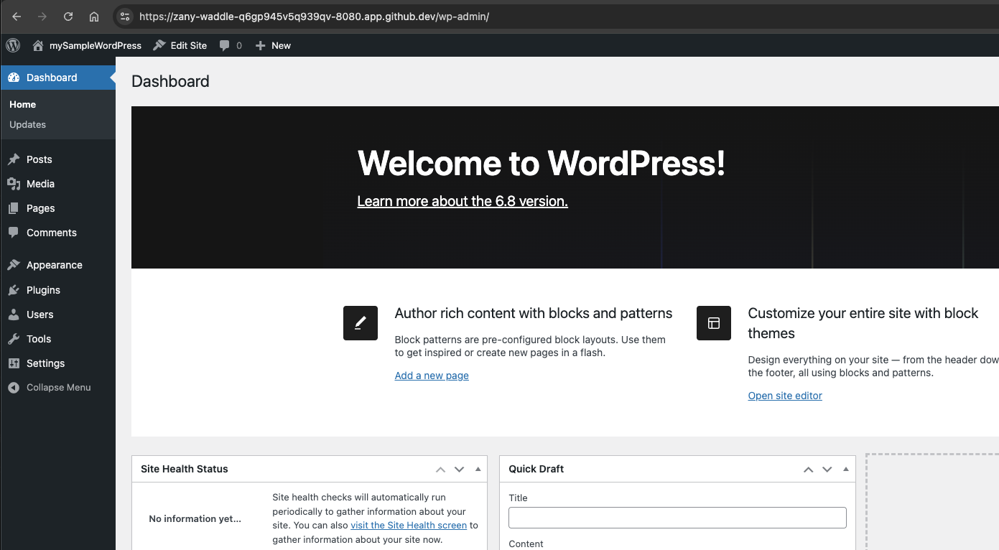

# Wordpress and PhpMyAdmin on Docker

In this example, we will install Wordpress (latest version), MySql 8.0 and Php my admin.

## Option 1: Local Machine

### Docker Desktop

If you plan to use Docker Desktop, you can install Wordpress and PhpMyAdmin on your local machine. To do so, run the following commands:

```bash
cd wordpress-docker
docker-compose up --build -d
```

Then, navigate to [http://localhost:8080](http://localhost:8080) in your browser.

You can now see Wordpress installation steps, which will guide you through the installation process.

Also, you should then be able to access PhpMyAdmin at [http://localhost:8081](http://localhost:8081).


## Option 2: Codespaces

If you plan to use Codespaces, you can install Wordpress and PhpMyAdmin on your local machine. To do so, run the following commands:

```bash
cd wordpress-docker
docker-compose up --build -d
```


Then after the compose is up, you should be able to access Wordpress at [https://codespaces-8080.app.github.dev](hhttps://codespaces-8080.app.github.dev) and PhpMyAdmin at [https://codespaces-8081.app.github.dev](https://codespaces-8081.app.github.dev).
Note that you may have to delete :8080 from the web address to access PhpMyAdmin and Wordpress.

After the installation steps, you have to go to PhpMyAdmin and login using the username and password provided in the .env file.

After you sign in, you will see the database you created during the installation process.


In phpMyAdmin, you can now edit the site URL from the database settings.

Next step is logging in to Wordpress.

After you sign into Wordpress, you will see the control panel. You can edit the pages, install plugins, etc.



Follow the steps in the slides to use Wordpress and PhpMyAdmin.